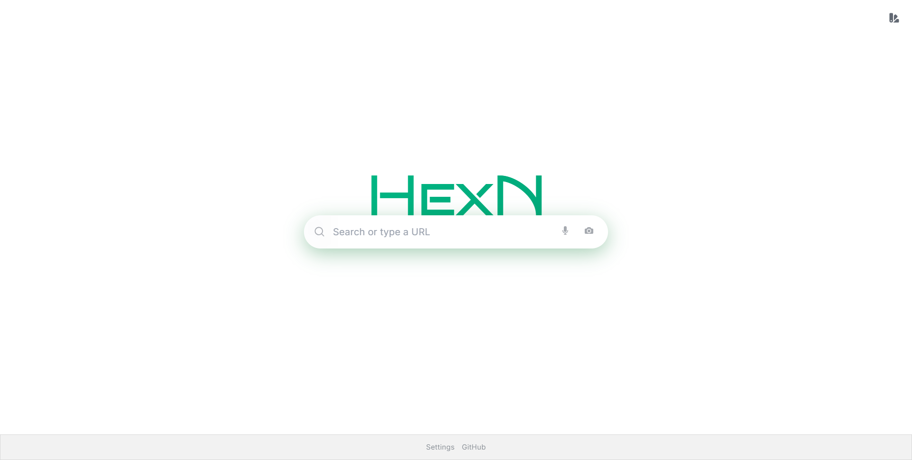
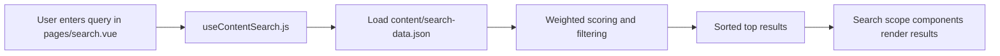
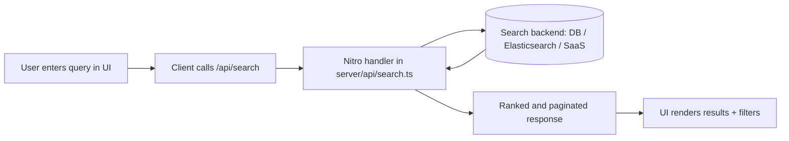
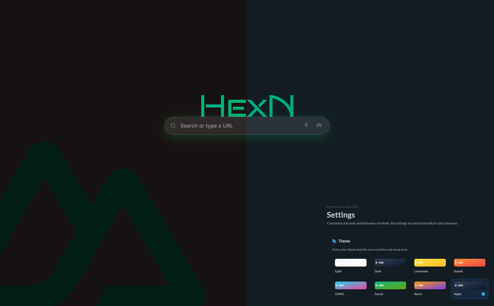

# Hexn - Personal & Independent Search Engine


[](https://opensource.org/licenses/MIT)

Hexn is an open-source search project for building your own independent, privacy-focused search experience.



## Live Demo

[](https://hexnsearch.alihdtech.workers.dev)

Hexn v1 deployed on Cloudflare : [[hexnsearch.alihdtech.workers.dev](https://hexnsearch.alihdtech.workers.dev/)].

[](https://hexn.vercel.app)  
Hexn v2 on Vercel : [hexn.vercel.app](https://hexn.vercel.app).

## Overview

- Nuxt 3, Vue 3, Tailwind CSS, DaisyUI
- Nuxt Content for topic pages with Custom weighted search from `content/search-data.json`

## Quick Start

### Prerequisites

- Node.js 18+
- pnpm (recommended) or npm

### Install and run

```bash
git clone https://github.com/alihd-tech/hexn.git
cd hexn
pnpm install
pnpm dev
```

Open [http://localhost:3000](http://localhost:3000).

### Build and preview

```bash
pnpm build
pnpm preview
```

## Project Structure

```text
hexn/
├── app.vue
├── nuxt.config.ts
├── assets/css/main.css
├── components/
├── composables/useContentSearch.js
├── content/
│   ├── search-data.json
│   └── topics/
├── pages/
│   ├── index.vue
│   ├── search.vue
│   └── topics/[slug].vue
└── public/
```

## How It Works

- Routes are file-based from `pages/`
- Topic content lives in `content/topics/*.md`
- Search results are loaded and scored on the client from `content/search-data.json`

For larger datasets, move search to a Nitro API route under `server/api/` and keep the UI unchanged.

## Search architecture diagrams

### Current architecture (client-side index search)



### Scaled architecture (API/server-side search)



## Extend the Project

- Add new pages in `pages/`
- Add new topic articles in `content/topics/`
- Expand search records in `content/search-data.json`
- Add shared logic in `composables/`
- Add reusable UI in `components/`

## License

This project is licensed under the MIT License.



