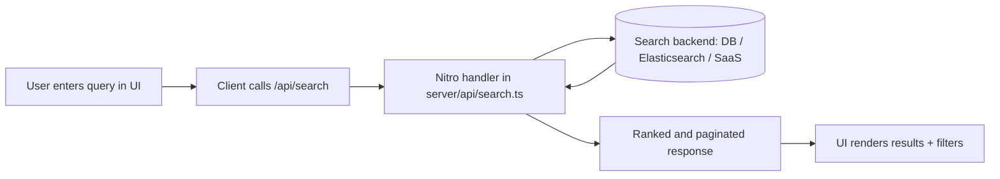

# Hexn - Personal & Independent Search Engine


[](https://opensource.org/licenses/MIT)

**Hexn** is an open-source search platform built for everyone to build personal search engine. Search the web by building it.


## 🌟 Features

- **🔒 Privacy First**: No tracking, no data collection, no user profiling 
- **⚡ Fast & Lightweight**: Optimized for speed and performance (but Limited)
- **🎨 Modern UI**: Beautiful, responsive design with dark/light themes (Basicly it's Baby Google :)
 
## 🛠️ Tech Stack

- **Frontend**: Nuxt 3 + Vue 3 + Tailwind CSS + DaisyUI 
- **Content**: Nuxt Content
- **Search**: Custom content search implementation

## 🚀 Quick Start

### Prerequisites

- Node.js 18+ 
- pnpm (recommended) or npm

### 1) Clone and install

```bash
git clone https://github.com/alihd-tech/hexn.git
cd hexn
pnpm install
```

### 2) Run locally

```bash
pnpm dev
```

Open [http://localhost:3000](http://localhost:3000).

### 3) Production preview (recommended before deploy)

```bash
pnpm build
pnpm preview
```

`pnpm preview` serves the production build so you can verify routing, metadata, and search behavior before publishing.

## 🏗️ Project structure

```
hexn/
├── app.vue                      # Root shell (theme baseline, wraps <NuxtPage />)
├── nuxt.config.ts               # Modules, SEO meta, runtimeConfig, Tailwind/CSS
├── tailwind.config.js           # Tailwind + DaisyUI theme wiring
├── tsconfig.json
├── assets/
│   └── css/
│       └── main.css             # Global styles (Tailwind layers, custom UI)
├── components/                   # Vue SFCs (Nuxt auto-import)
│   └── SearchFilters.vue         # Search sidebar filters (local state; extend to wire search)
├── composables/                  # Shared logic (Nuxt auto-import)
│   └── useContentSearch.js      # Client search: load index, score, highlight, dates
├── content/                      # @nuxt/content sources
│   ├── search-data.json         # Curated search index (JSON corpus for results)
│   └── topics/                  # Topic articles (*.md) with YAML frontmatter
├── pages/                        # File-based routes
│   ├── index.vue                # Landing + search entry
│   ├── search.vue               # Results page (uses useContentSearch)
│   ├── settings.vue
│   └── topics/
│       └── [slug].vue           # Dynamic topic pages from content/topics/:slug.md
├── public/                       # Served as static files (icons, robots.txt, manifest)
```

Generated folders such as `.nuxt/`, `.output/`, `dist/`, and `node_modules/` are build artifacts and dependencies; they are not source layout.

## Architecture & paradigm

Hexn is a **Nuxt 3** app that combines:

- **File-based routing** — Everything under `pages/` maps to URLs. Dynamic segments like `topics/[slug].vue` render one page per Markdown file in `content/topics/` with a matching slug.
- **Content vs. search index** — Long-form editorial content lives in **`content/topics/*.md`** (frontmatter + body). The **search experience** is powered by **`content/search-data.json`**, a separate curated list of result records (title, URL, tags, category, etc.). Topics and search results can overlap conceptually but are maintained through two pipelines until you unify them (for example by generating JSON from Content at build time).
- **Client-side relevance search** — `composables/useContentSearch.js` loads the JSON index (dynamic import), applies a simple **weighted score** (title → tags → description → domain → category), sorts, and caps results. No database or external API is required for the default behavior.

This is essentially a **static-first, content-driven front end** with a **bundled search index**. The `server/` directory is the natural place to add **Nitro API routes** when you outgrow purely client-side search.

### Search architecture diagrams

#### Current architecture (client-side index search)


#### Scaled architecture (API/server-side search)



This migration keeps the current UI mostly unchanged while moving heavy search logic and indexing to the server.

## Extending the project

| Goal | Where to work |
|------|----------------|
| New page or route | Add `pages/your-route.vue` (or a folder with `index.vue`). Use `navigateTo`, `<NuxtLink>`, or query params as needed. |
| New topic article | Add `content/topics/your-slug.md` with YAML frontmatter (`title`, `description`, `category`, `date`, etc.). It will be available at `/topics/your-slug`. |
| More or richer search results | Extend **`content/search-data.json`** (`searchResults` array). Keep fields consistent so `useContentSearch` scoring stays meaningful; adjust weights or fields in **`useContentSearch.js`** if you add new properties. |
| Shared behavior (theme, search helpers, API clients) | Add **`composables/useYourFeature.ts`** (or `.js`) and call it from pages without manual imports where Nuxt auto-import applies. |
| Reusable UI | Add components under **`components/`**; Nuxt registers them automatically. |
| Sidebar filters that affect results | Today **`SearchFilters.vue`** holds local filter state only. Lift state up (e.g. to `pages/search.vue`) or use **`provide/inject`** / a small store, then filter the array returned by **`searchContent`** or pass criteria into a future API. |
| Backend search or proxies | Add **`server/api/*.ts`** (or `server/routes`) for Nitro handlers: query a DB, Elasticsearch, or an external search API, then call those endpoints from the client with **`$fetch`** or **`useFetch`**. |

When the JSON index grows large, consider generating **`search-data.json`** from a script or from **`@nuxt/content`** query at build time so editorial updates stay in sync.

## Scaling & operations

- **Traffic & caching** — Deploy the **Nuxt/Nitro** build (e.g. NuxtHub or any host that serves `.output`). Put the **static `public/`** assets behind a CDN; enable HTTP caching headers appropriate for HTML vs. hashed `_nuxt` assets.
- **Search at scale** — Replace or supplement the JSON + client scoring path with **server-side search** (indexed store, hosted search SaaS, or open-source engine) and thin the client to **query + render**. Paginate (`useContentSearch` currently returns a fixed top slice) and debounce input for heavy queries.
- **Content scale** — Split topics into collections, add **locale-prefixed routes**, or use **Content** querying with tags; keep build times acceptable by limiting per-page payload.
- **Observability** — Use Nitro logging, external APM, and your analytics stack; keep **runtimeConfig** secrets out of client-exposed keys.
 

### Common deployment issues

- **Runtime mismatch**: verify Node runtime compatibility with your Nuxt version.
- **Search payload too large**: move to API-backed search when `search-data.json` becomes heavy.
 
## 📄 License

This project is licensed under the MIT License.


## Misc. 


 
- **GitHub**: [alihd-tech](https://github.com/alihd-tech) 
*for users to start building an independent, and privacy-focused search engine for their own.*
